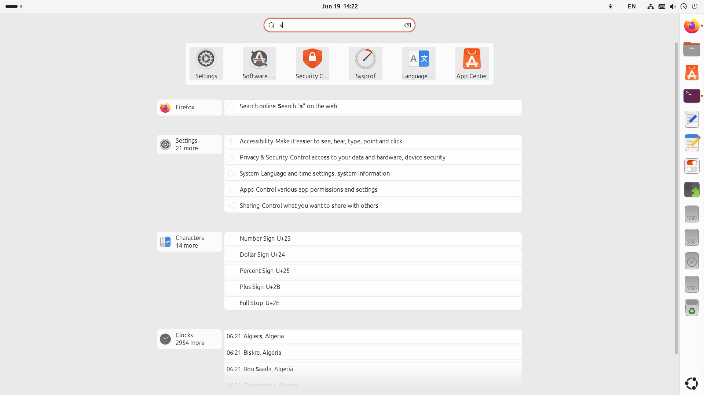
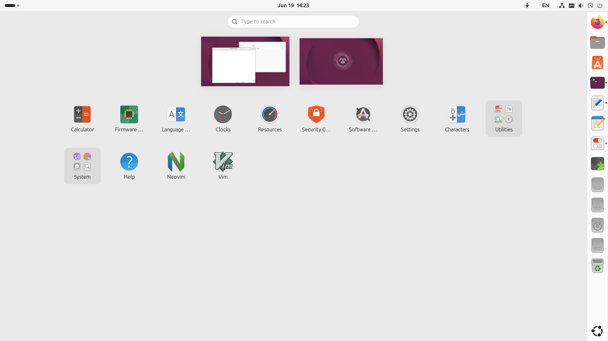

# Yaru-light

## Installation
Place this theme under user directory `~/.local/share/themes/Yaru-light/` and enable the [User Themes](https://extensions.gnome.org/extension/19/user-themes/) extension to load it.

Go to `Tweaks - Appearance - Shell - Yaru-light` and select it to apply the theme.

## Prerequisites

[GNOME Tweaks](https://wiki.gnome.org/Apps/Tweaks) and [GNOME Extensions](https://apps.gnome.org/Extensions/) [Manager](https://mattjakeman.com/apps/extension-manager) are needed to manage user themes.

```bash
sudo apt install gnome-shell-extension-manager gnome-tweaks
```




## License  
Whatever the original source code of Yaru came with.