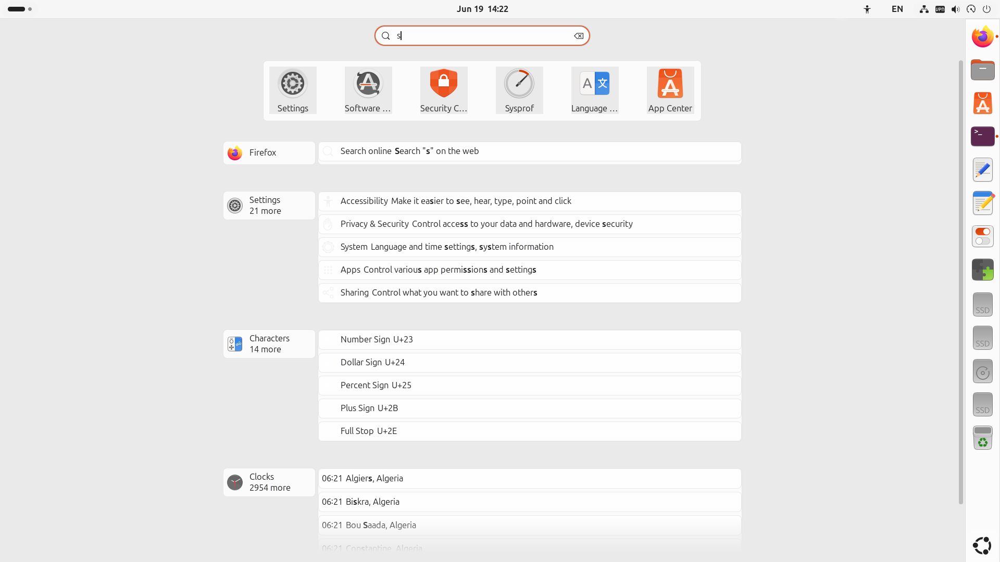
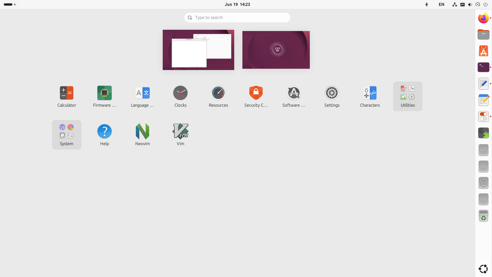

# Yaru-light

Yaru-light got rid of all dark panels from the Yaru theme.

Tested under `Ubuntu 26.04 LTS GNOME Shell 50.1` and `Fedora Silverblue GNOME 50.0`.

## Installation
Place this theme under user directory `~/.local/share/themes/Yaru-light/` and enable the [User Themes](https://extensions.gnome.org/extension/19/user-themes/) extension to load it.

Go to `Tweaks - Appearance - Shell - Yaru-light` and select it to apply the theme.

### Quick install
```bash
mkdir -p ~/.local/share/themes/Yaru-light/
curl -sL $(curl -s https://api.github.com/repos/spookyrunt/Yaru-light/releases/latest |
  jq -r '.assets[0].browser_download_url') |
  tar -xzv -C ~/.local/share/themes/Yaru-light/ --strip-components=1
gsettings set org.gnome.shell.extensions.user-theme name "Yaru-light"
```

## Prerequisites

[GNOME Tweaks](https://wiki.gnome.org/Apps/Tweaks) and [GNOME Extensions](https://apps.gnome.org/Extensions/) [Manager](https://mattjakeman.com/apps/extension-manager) are needed to manage user themes.

```bash
sudo apt install gnome-shell-extension-manager gnome-tweaks
```

[Light Style](https://extensions.gnome.org/extension/6198/light-style/) can help cover extension elements missed by this theme, such as [Window List](https://extensions.gnome.org/extension/602/window-list/) on Fedora.




## License  
Whatever the original source code of Yaru came with.
